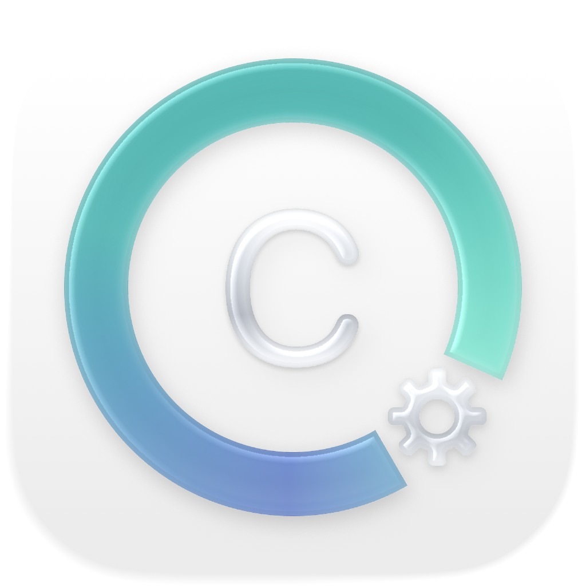
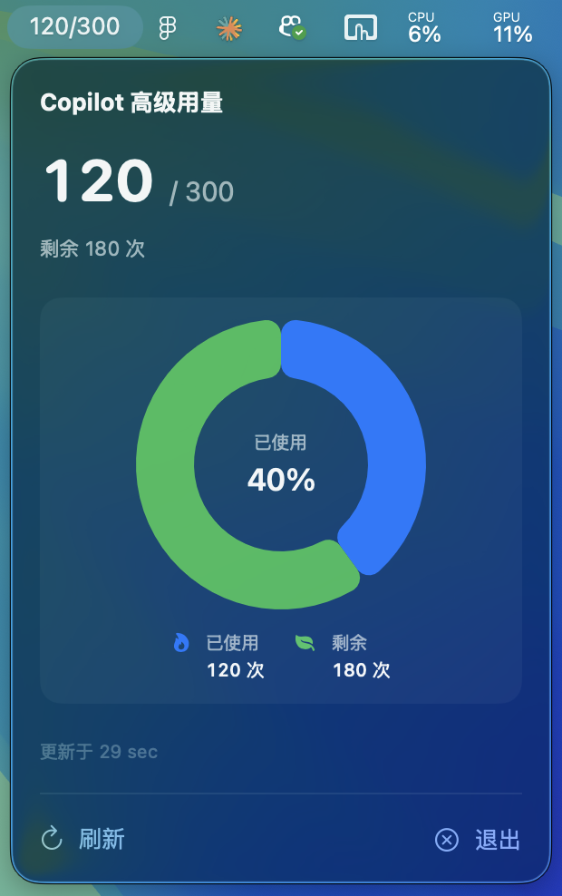

# Copilot Usage Status（macOS 菜单栏应用）

<div align="center">
  
  
</div>

Copilot Usage Status 是一个简洁的 macOS 菜单栏应用，用于从本地服务拉取并展示 GitHub Copilot 的「premium_interactions」用量。应用采用 SwiftUI + MVVM 架构，支持自动定时刷新、网络错误提示、以及可视化圆环图表。

— 主要特色 —
- 菜单栏展示：在 Menubar 中直接显示已用次数或进度。
- 实时刷新：默认每 60 秒拉取一次最新用量，支持手动刷新。
- 自定义 API 地址：可在应用面板中配置自定义 API URL，支持非默认端口或远程服务器。
- 兼容解析：同时支持响应体顶层字段和 `quota_snapshots.premium_interactions` 嵌套结构。
- 可视化图表：使用 Swift Charts 绘制甜甜圈图，直观呈现已用/剩余比例。
- 健壮网络：支持 `http://localhost:4141` 与 `http://127.0.0.1:4141` 自动兜底；完善的错误文案。
- 无障碍支持：VoiceOver 可读的标签与数值，键盘操作友好。

— 接口约定 —
- 默认请求地址：`GET http://localhost:4141/usage`
- 自定义 API 地址：可在应用面板的"API 地址设置"中输入自定义 URL（如 `http://192.168.1.100:8080` 或 `http://custom-server:4141`），留空则使用默认地址。
- 示例返回（截断显示）：
```
{
  "quota_snapshots": {
    "premium_interactions": {
      "entitlement": 300,
      "quota_remaining": 180,
      "percent_remaining": 60,
      "unlimited": false
    }
  }
}
```
应用将据此推导：`used = entitlement - quota_remaining`，并在菜单栏与面板中展示。

— 运行与构建 —
- 最低系统：macOS 14（使用 MenuBarExtra/SwiftUI）。
- 打开工作区：`CopilotUsageStatus/CopilotUsageStatus.xcworkspace`。
- 命令行构建：
  - `xcodebuild -project CopilotUsageStatus/CopilotUsageStatus.xcodeproj -scheme CopilotUsageStatus -configuration Debug build`
  - 或使用 workspace：`xcodebuild -workspace CopilotUsageStatus/CopilotUsageStatus.xcworkspace -scheme CopilotUsageStatus -configuration Debug build`
- 运行本地服务：确保 `localhost:4141/usage` 可访问（可先用 `curl http://localhost:4141/usage` 验证）。

— 权限与配置 —
- ATS 例外：`Config/Shared.xcconfig` 已允许 `http://localhost` 明文访问。如使用自定义远程 HTTP 地址，需额外配置 ATS。
- 沙盒权限：`Config/CopilotUsageStatus.entitlements` 已开启 `com.apple.security.network.client` 出站网络权限。
- IPv4 兜底：网络层在 `localhost` 失败时自动尝试 `127.0.0.1`（仅默认地址）。
- 自定义 URL：应用会将自定义 URL 保存在 UserDefaults 中，下次启动时自动加载。

— 代码结构 —
```
CopilotUsageStatus/
├── CopilotUsageStatus.xcodeproj/                # App 工程（含本地 Package 引用）
├── CopilotUsageStatus.xcworkspace/              # 工作区
├── CopilotUsageStatus/                          # App Target（外壳）
│   ├── CopilotUsageStatusApp.swift              # 入口，MenuBarExtra
│   ├── Assets.xcassets                          # 资源
│   └── Config/*.xcconfig, *.entitlements        # 构建/沙盒配置
└── CopilotUsageStatusPackage/                   # 业务代码（SPM）
    ├── Package.swift
    └── Sources/CopilotUsageStatusFeature/
        ├── ContentView.swift                    # 面板 UI 与图表
        ├── UsageStatusViewModel.swift           # MVVM VM（刷新/状态）
        ├── UsageService.swift                   # 网络：URLSession + 兜底
        ├── UsageModels.swift                    # 兼容解码模型
        └── UserSettings.swift                   # 用户设置（自定义 URL）
```

— 开发指南 —
- 架构：SwiftUI-first、MVVM、async/await；菜单栏使用 `MenuBarExtra`。
- 模型：兼容 `premium_interactions` 在顶层或嵌套于 `quota_snapshots` 的两种结构；字段支持 `entitlement`、`quota_remaining`、`percent_remaining`、`unlimited` 等。
- 刷新：`UsageStatusViewModel` 默认间隔 60s；调用 `refreshNow()` 可手动刷新。
- 图表：如可用，使用 Swift Charts 绘制甜甜圈；无 Charts 环境下回退为线性进度条。
- 无障碍：`accessibilityLabel/value` 覆盖菜单项与图表中心文案。

— 使用自定义 API 地址 —
1. 点击菜单栏图标打开应用面板。
2. 在"API 地址设置"部分，输入自定义 API 的完整 URL（如 `http://192.168.1.100:8080` 或 `https://remote-server.com:4141`）。
3. 应用会自动验证 URL 格式，并显示"地址有效"或"地址无效"的提示。
4. 保存后，应用会立即使用新地址刷新数据，无需重启。
5. 点击"重置"按钮可恢复使用默认的 `http://localhost:4141`。

— 常见问题（Troubleshooting） —
- 显示“无法连接到服务”：
  - 确认本地服务已启动并监听 4141 端口。
  - 用 `curl http://localhost:4141/usage` 验证；若仅 IPv4 可用，请确认应用已重启以启用兜底。
- 显示“缺少 premium_interactions 数据”：
  - 检查返回是否为嵌套结构（见示例）；应用已支持自动解析。
- 构建警告 “Traditional headermap style…”：
  - 已通过 `ALWAYS_SEARCH_USER_PATHS = NO` 关闭传统 headermap。

— 测试 —
- 可在 SPM Tests 目录下为 `UsageService`/`UsageStatusViewModel` 添加单元测试，模拟 Provider 返回值、超时与错误分支。

— 许可证 —
本仓库示例未附带开源许可证；如需对外开源，请按需添加许可文件。
